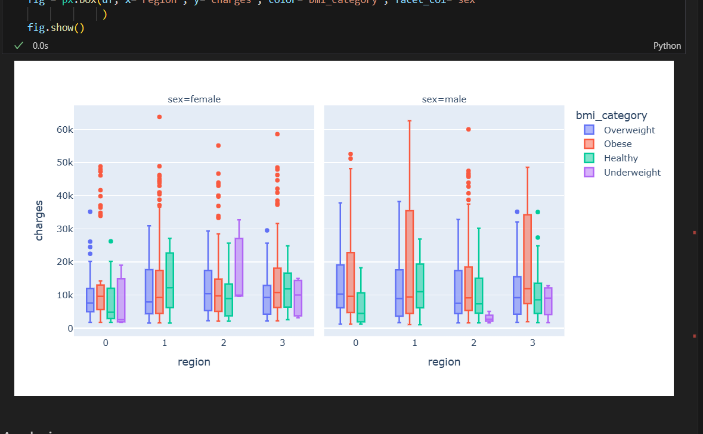
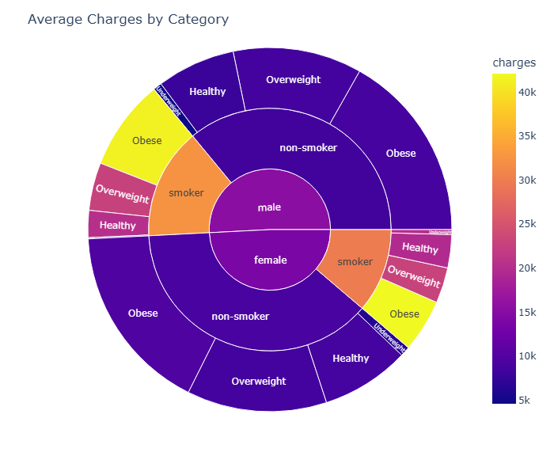

# 

## Health Insurance Analysis

### Summary

This project analyzes health insurance data to understand the impact of various factors—such as BMI, smoking status, age, sex, and region—on medical charges. The workflow includes data cleaning, transformation, and visualization using Python (pandas, matplotlib, seaborn, plotly). Key findings are presented through interactive charts and statistical summaries, highlighting how combinations of high BMI and smoking status significantly increase insurance costs. The project aims to provide insights for healthcare insurances users.

## Conclusions

Smoking status and BMI are the strongest predictors of high medical charges, with smokers and those classified as obese incurring the highest costs.
Age consistently influences charges, but its effect is amplified when combined with smoking or high BMI.
Regional and sex differences exist, but their impact is less pronounced compared to BMI and smoking.
The analysis highlights a clear multiplier effect: individuals who smoke and have a high BMI face significantly higher insurance costs.
These insights can inform healthcare policy, risk assessment, and targeted interventions to reduce costs.

### Limitations & Ethical Consdiderations

* the data set covered was relatively small
* the data set does not include other potential contributing factors to healthcare costs e.g. alchohol consumption, underlying conditions such as diabetes
* I also excluded the number of children which may be a factor in costs
* There is no progessive analysis possible as this was a snapshot rather than a time series - so the effects of changes cannot be plotted (e.g. stopping smoking, losing weight)
* BMI can sometimes be a crude measure (for instance heavily muscled athletes may be classified as obese). It may also be used to stigmatise

### Screenshots for plotly

### Acknowledgements & References

Thanks to Vasi, Mark and Niel at CodeInstitute and the rest of my cohort

I used various sources when looking at BMI data, particularly;

 [American Cancer Society BMI Index](https://www.cancer.org/cancer/risk-prevention/diet-physical-activity/body-weight-and-cancer-risk/body-mass-index-bmi-calculator.html)

 and also,
(https://therapies.heartofengland.nhs.uk/wp-content/uploads/bmi_chart.pdf)

## Challenges ##

The data cleaning phase of the project was relatively straightforward, as the csv used was largely already cleaned. The biggest decisions were which columns to drop (Children), and which columns to transform, generally from categorical to numerical. Some of these I later changed back to facilitate visualisation phase. I also added a column to categorise BMI (in line with known guidelines, see above).

I had some challenges during the visualisation face but was able to satisfactorily overcome these. The biggest challenge was to decide which visualitions would best suit my project aims, and where necessary how to format data. I also had three minor technical difficulties:

* filepaths would sometimes become broken (caused by changes to working directory I believe)
* I have included plotly screenshots in this README but was unable to show them within the DataVisualisation notebook (again a filepath problem)
* I found it difficult to label some visualisations as I would like, though was largely able to resolve this.

## Technical Information ##

The technologies used included Jupyter notebooks for data analysis using Pandas, seaborn and numpy to view and manipulate data and also Feature_engine for cleaning data.
Matplotlib, Seaborn and Plotly were used to visualise data
I used Gitub Copilot to explain and amend some complex code, though generally I was able to complete the code myself.
I also used Copilot to help summarise some information.
The project was developed in VSCode using a virtual environment (see requirements.txt for a full list of packages used)

